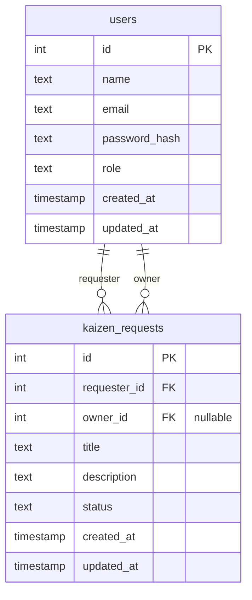

# Database Schema

```mermaid
erDiagram
    users {
        int id PK
        text name
        text email
        text password_hash
        text role
        timestamp created_at
        timestamp updated_at
    }

    kaizen_requests {
        int id PK
        int requester_id FK
        int owner_id FK "nullable"
        text title
        text description
        text status
        timestamp created_at
        timestamp updated_at
    }

    users ||--o{ kaizen_requests : "requester"
    users ||--o{ kaizen_requests : "owner"
```
