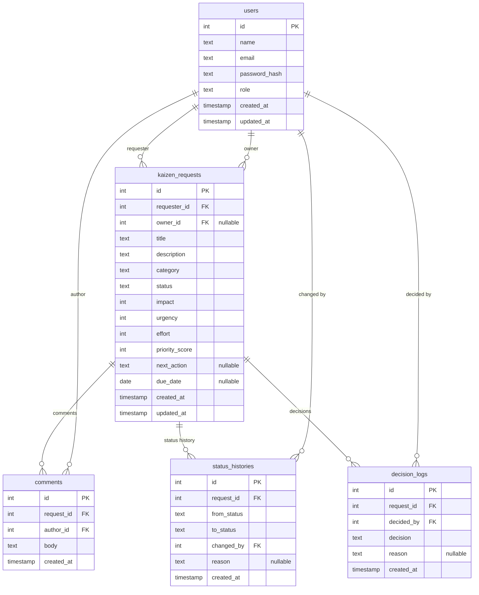

# Database Schema

```mermaid
erDiagram
    users {
        int id PK
        text name
        text email
        text password_hash
        text role
        timestamp created_at
        timestamp updated_at
    }

    kaizen_requests {
        int id PK
        int requester_id FK
        int owner_id FK "nullable"
        text title
        text description
        text category
        text status
        int impact
        int urgency
        int effort
        int priority_score
        text next_action "nullable"
        date due_date "nullable"
        timestamp created_at
        timestamp updated_at
    }

    comments {
        int id PK
        int request_id FK
        int author_id FK
        text body
        timestamp created_at
    }

    status_histories {
        int id PK
        int request_id FK
        text from_status
        text to_status
        int changed_by FK
        text reason "nullable"
        timestamp created_at
    }

    decision_logs {
        int id PK
        int request_id FK
        int decided_by FK
        text decision
        text reason "nullable"
        timestamp created_at
    }

    users ||--o{ kaizen_requests : "requester"
    users ||--o{ kaizen_requests : "owner"
    kaizen_requests ||--o{ comments : "comments"
    users ||--o{ comments : "author"
    kaizen_requests ||--o{ status_histories : "status history"
    users ||--o{ status_histories : "changed by"
    kaizen_requests ||--o{ decision_logs : "decisions"
    users ||--o{ decision_logs : "decided by"
```
